# Hands-on Red Hat Developer Hub Lab

In this lab, you will go through the process of creating, building, and deploying a sample application using the services provided by the Red Hat Developer Hub.  This process will include:

* Creating a GitHub Repo for your application
* Provide a method to compile and build the application
* Building a Dockerfile to containerize your application image
* Uses Open Liberty Operator and tools to aid in deployment using standard GitOps patterns
* Utilize GitHub actions to trigger CI/CD process
* Utilize standard CI/CD tools like Tekton, ArgoCD and Kubernetes

# Steps:

- [Hands-on Red Hat Developer Hub Lab](#hands-on-red-hat-developer-hub-lab)
- [Steps:](#steps)
  - [1. Initial OCP setup](#1-initial-ocp-setup)
    - [Login to the OpenShift console, using the following URL:](#login-to-the-openshift-console-using-the-following-url)
    - [Install Red Hat Marketplace Operators](#install-red-hat-marketplace-operators)
    - [Use default project](#use-default-project)
  - [2. Create Developer Hub instance](#2-create-developer-hub-instance)
    - [Apply the config map for our Developer Hub instance](#apply-the-config-map-for-our-developer-hub-instance)
    - [Create secret for the backend Developer Hub](#create-secret-for-the-backend-developer-hub)
  - [3. Add GitHub integration](#3-add-github-integration)
    - [Create secrets for GitHub integration](#create-secrets-for-github-integration)
  - [4. Create Keycloak resources](#4-create-keycloak-resources)
  - [5. Create Service Account](#5-create-service-account)
    - [Assign Role Binding to our Service Account](#assign-role-binding-to-our-service-account)
    - [Update Secrets with Service Account token](#update-secrets-with-service-account-token)
  - [6. Create ArgoCD instance](#6-create-argocd-instance)
    - [Update config map with ArgoCD values](#update-config-map-with-argocd-values)
  - [7. Create a dynamic plug-in config map](#7-create-a-dynamic-plug-in-config-map)
  - [8. Reconfigure the Red Hat Developer Hub Operator](#8-reconfigure-the-red-hat-developer-hub-operator)
  - [9. Open Backstage Developer Hub](#9-open-backstage-developer-hub)
    - [Create Liberty App](#create-liberty-app)

## 1. Initial OCP setup

### Login to the OpenShift console, using the following URL:

```bash
https://console-openshift-console.apps.ocp.ibm.edu
```

Use username: `ocadmin`. Use the password specified in the Lab Guide.

### Install Red Hat Marketplace Operators

For convenience, all required Operators have already been installed on your OpenShift cluster. These include:

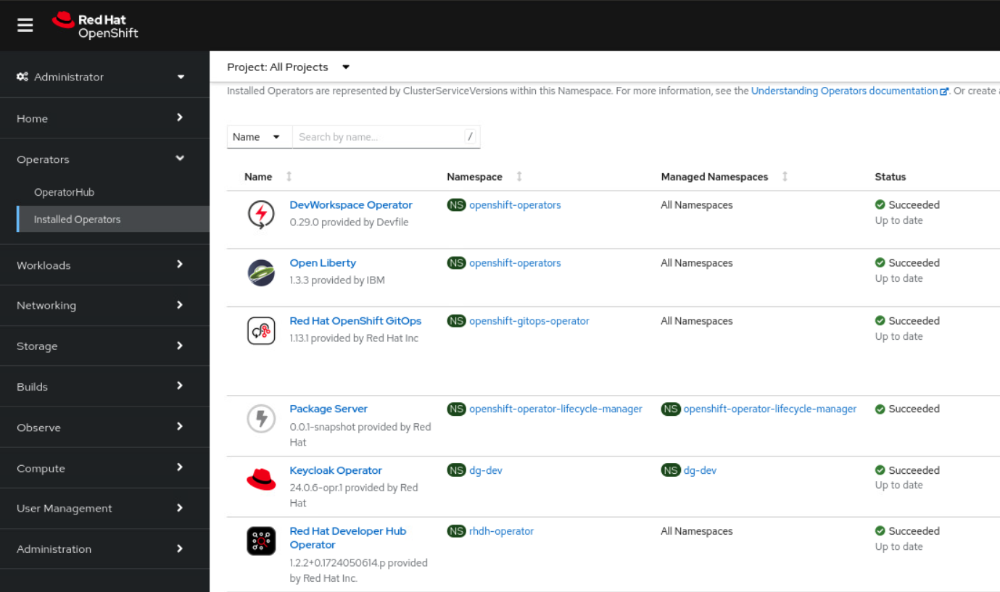

- Open Liberty - framework for developing cloud-native Java microservices
- Red Hat OpenShift GitOps - a Continuous Delivery platform based on Argo CD
- Keycloak Operator - used to securely authenticate to applications
- Red Hat Developer Hub Operator - framework for building and managing developer portals 

To verify these operators are installed:
- Switch to the Developer view.
- Open up the `Operators` menu item, and select `Installed Operators`.
- Ensure the `Project` filter at the top of the list is set to `All Projects`.

### Use default project

For convenience, we will be using the `default` project/namespace for this lab. This allows service routes to be hard coded in YAML files that you will be asked to apply. This should make editing of the files easier, or not required, which limits the chance for typos or missed changes.  

>**IMPORTANT**: Ensure the `default` project is selected when completing the remaining steps in this lab.  

## 2. Create Developer Hub instance

From the Developer view:
- Go to `+Add` and select `Operator Backed` from the `Developer Catalog` section.

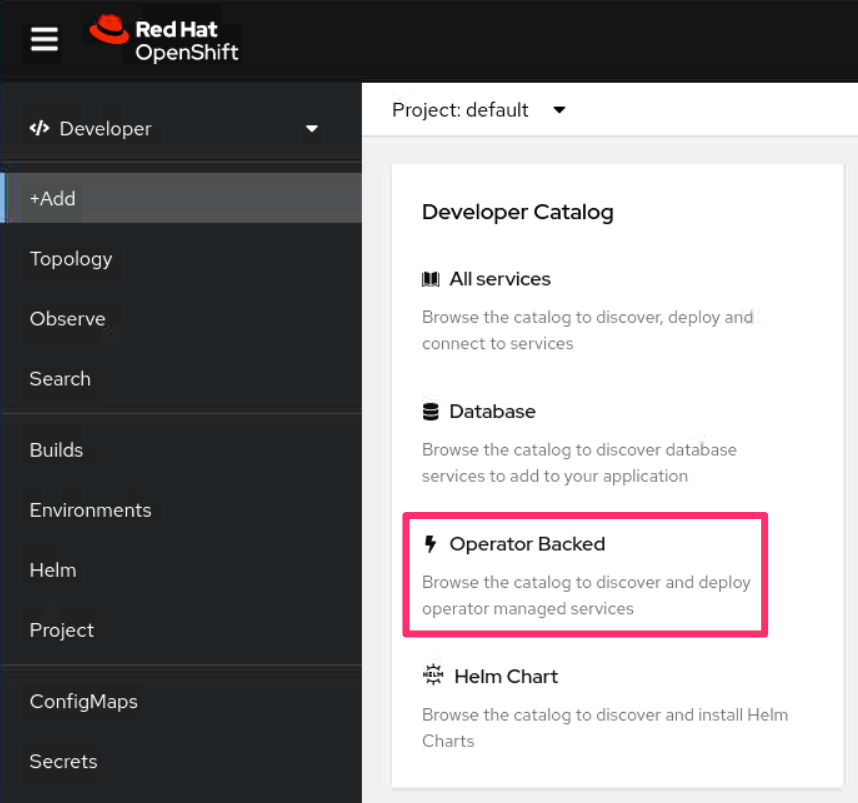

- From the list of options, select `Red Hat Developer Hub`.

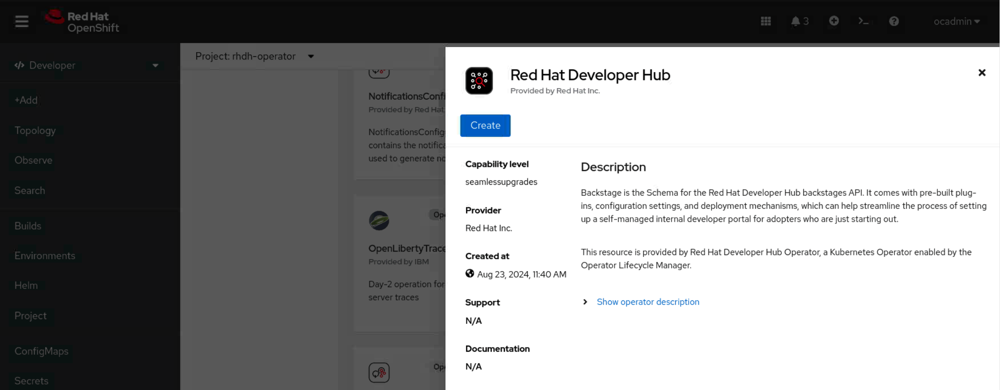

- Click the `Create` button.
- This will bring up the `Create Backstage` panel.

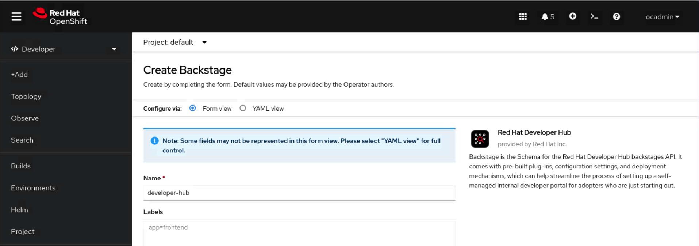

- For now, leave all the fields with their default values and click `Create`.

  Please be patient, as this may take several minutes to complete.

- Once instantiated, you will be able to view the instance by clicking the `Topology` view.

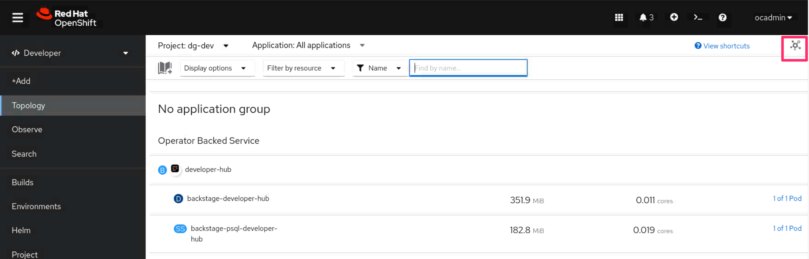

- Click the graph icon in the upper right to get a graphical view.

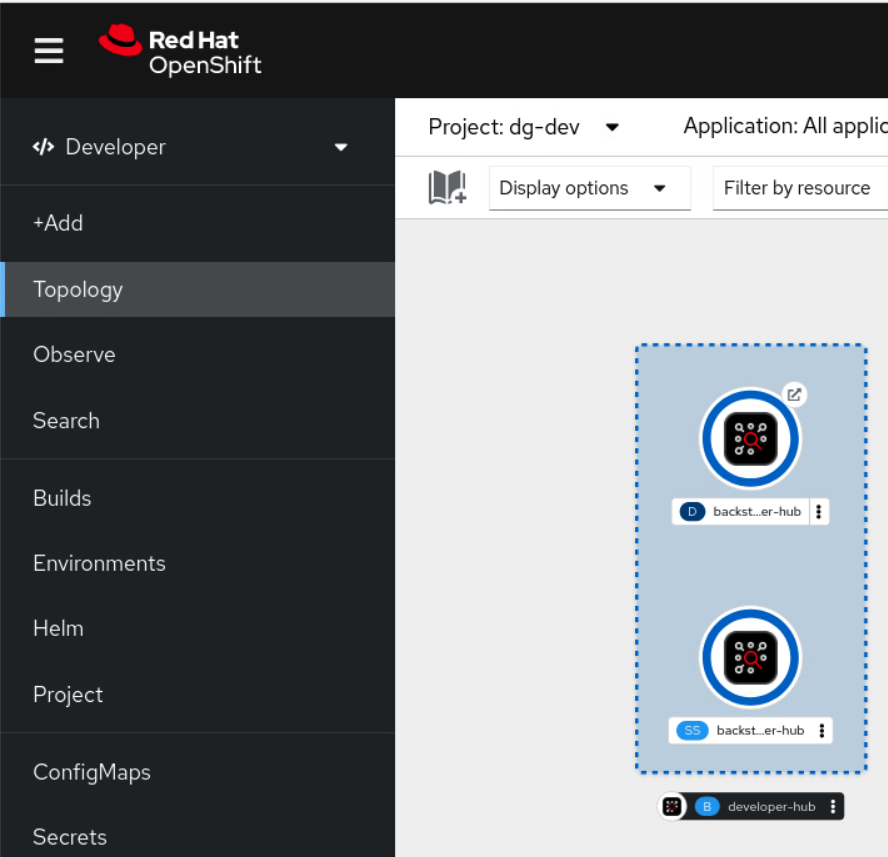

### Apply the config map for our Developer Hub instance

Click the `Import YAML` button located at the top of the console.

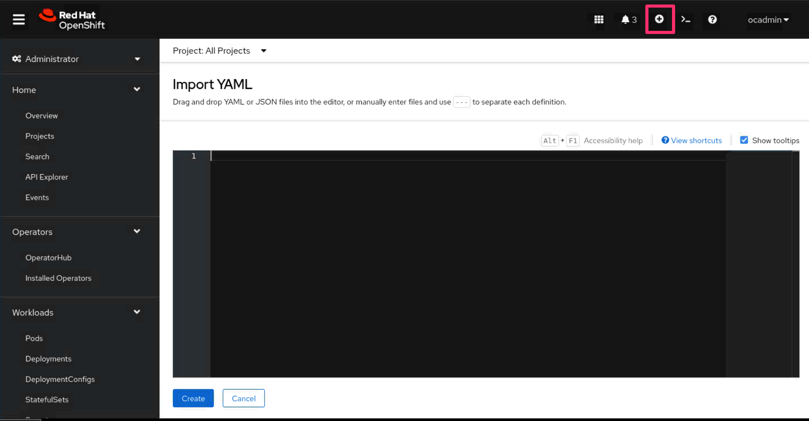

Copy and paste the contents of the file [app-config-rhdh.yaml](https://github.com/rhagarty/techxchange-rhdh/blob/main/app-config-rhdh.yaml) into the YAML editor.

>**NOTE**: Use `CTRL-v` to paste.

Click `Create` to save the config file.

This will create a `Config Map` named `app-config-rhdh`.

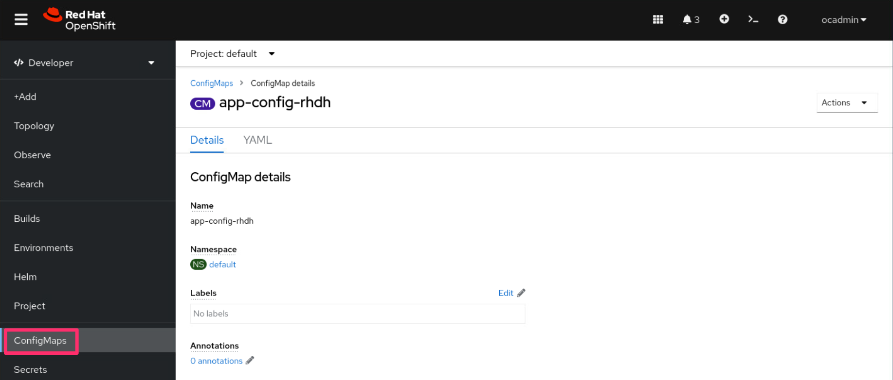

This version of the config map is filled with default values that will need to be update as we advance through the rest of the lab.

The config map has a number of variable names that we will need to assign proper values to using `Secrets`. It also has URLs that will need to be modified as we create services and proper links are generated.

### Create secret for the backend Developer Hub

From the Developer view:
- Click on the `Secrets` menu item.
- From the Secrets list, click on the `Create` drop-down menu on the right, and select `Key/value secret`.

In the Key/value secret form, enter the following values:
- Set `Secret name` to `secrets-rhdh`
- Set `Key` to `BACKEND_SECRET`
- Set `Value` to `password`

Click `Create` to add the secret.

Note that `BACKEND_SECRET` is referenced in the config map.

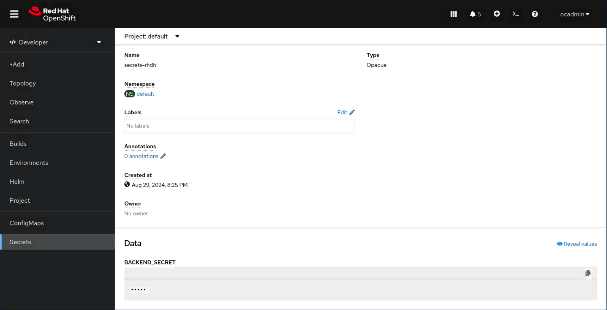

## 3. Add GitHub integration

For this you will need a public GitHub account.

Open a new browser tab to your GitHub account and log in.

- Click on your picture to bring up the user menu.
- Go to your `Settings` window, and then click on the `<> Developer Settings` menu item.
- Click on `GitHub Apps`.
- Click `New GitHub App`.

From the new GitHub app form:
- Enter any unique name for the app
- Enter any valid URL for the homepage - this value will not be used anywhere
- Leave `Callback URL` blank
- **[IMPORTANT]** Turn off `WebHook - Active`


For `Repository Permissions`, set the values to match the following:
- Actions: RW
- Administration RW
- Commit Statuses R
- Contents: RW
- Environments: RW
- Issues: RW
- Metadata: R
- Packages: RW
- Pull Requests: RW
- Secrets: RW
- Variables: RW
- Workflows: RW

For `Organization permissions`, set the values to match the following:
- Administration: RW
- Members: R
- Variables: RW

Click `Create GitHub App` to save.
  
Once created, you will get generated data concerning your app. Some of these values will need to be added to config map. Values needed include:

- Application ID
- Client ID

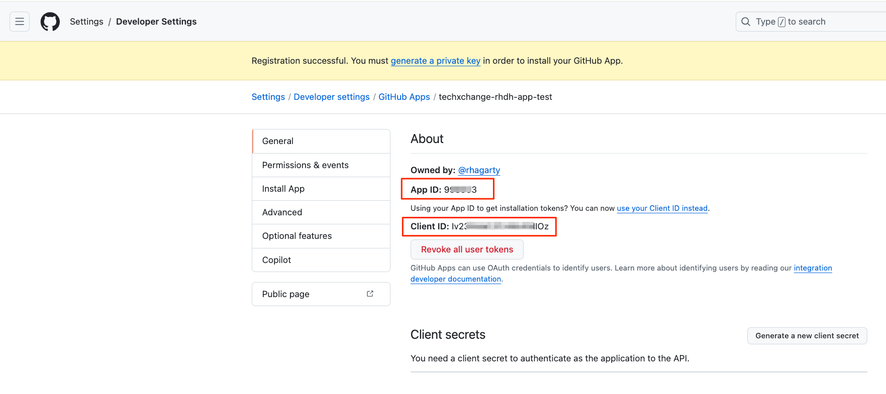

You will also need to generate a client secret and a private key. On this panel, click the associated button to generate both of these keys.

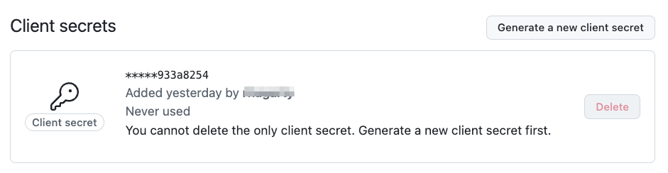

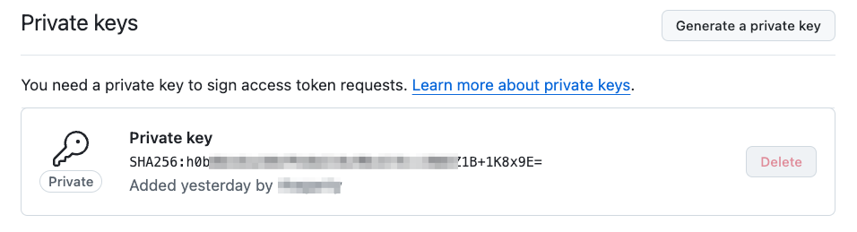

When generating your private key, you will be asked to authenticate your GitHub account. When successfully authenticated, a `.pem` file will be downloaded to the `Downloads` directory on your system. From a terminal window, use the `cat` command to display the file so that you can copy/paste the contents in the next step.

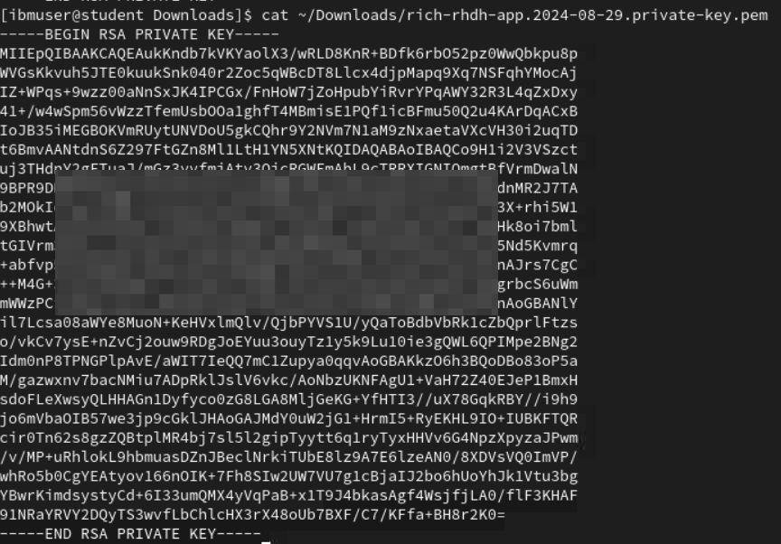

When you copy/paste, include everthing, including the `BEGIN RSA` and `END RSA` lines.

**DO NOT CLOSE this tab**! You will need to copy/paste these values to complete the next step.

You will also need to generate a personal access token. Open another tab to your GitHub account and click on your picture. 

- Click on `Settings`
- Click on `<> Developer settings`
- Click on the `Personal access tokens` drop down menu
- Select `Tokens (classic)`
- Click on the `Generate new token` drop down menu
- Select `Generate new token (classic)`

In the `New personal access token` panel:
- Enter `techxchange lab` or similar for note
- Turn on the following settings:
  - `repo`
  - `workflow`
  - `delete_repo`

Click the `Generate token` button to generate and display your personal access token.

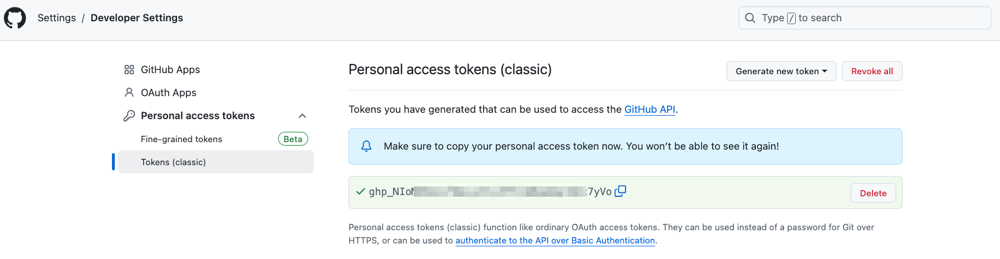

**DO NOT CLOSE this tab**! You will need to copy/paste your personal access token to complete the next step.

### Create secrets for GitHub integration

Go back to your OpenShift console, and from the Developer view:
- Click on the `Secrets` menu item.
- From the Secrets list, click on the `Create` drop-down menu on the right, and select `Key/value secret`.

In the Key/value secret form, enter the following values:
- Set `Secret name` to `rhdh-secrets-github-integration`
- Set `Key` to `RHDH_GITHUB_INTEGRATION_APP_CLIENT_ID`
- Set `Value` to the Client ID

Use the `+ Add key/value` to add another secret. Repeat this action to add the following secrets:

- Set `Key` to `RHDH_GITHUB_INTEGRATION_APP_CLIENT_SECRET` and `Value` to the Client Secret
- Set `Key` to `RHDH_GITHUB_INTEGRATION_APP_ID` and `Value` to the Application ID
- Set `Key` to `RHDH_GITHUB_INTEGRATION_APP_PRIVATE_KEY` and `Value` to the Private Key (downloaded .pem file)
- Set `Key` to `RHDH_GITHUB_INTEGRATION_PERSONAL_ACCESS_TOKEN` and `Value` to the Personal Access Token

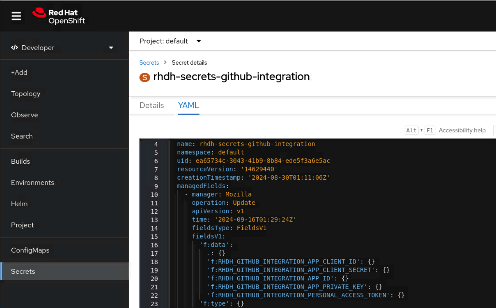

## 4. Create Keycloak resources

Apply the 3 Keycloak YAML files located in the [keycloak](https://github.com/rhagarty/techxchange-rhdh/tree/main/keycloak) directory.

Using the `Import YAML` button located at the top of the console, import the files in the following order:

1. `keycloak-postgres.yaml` - creates a database for Keycloak to connect to.

Insure the pod is up and running before continuing.

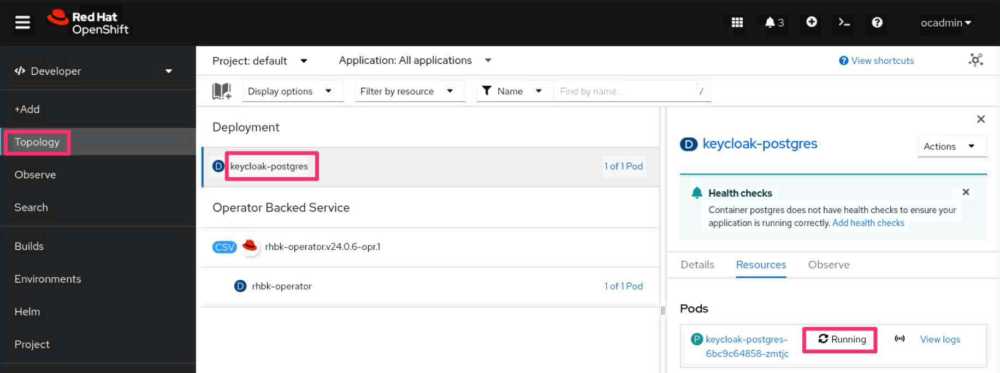

2. `keycloak-instance.yaml` - the OpenID Connect user management provider. 
3. `keycloak-realm.yaml` - pre-configured Keycloak users and access.

From the `Administrator` view, you should be able to see both Keycloak pods running:

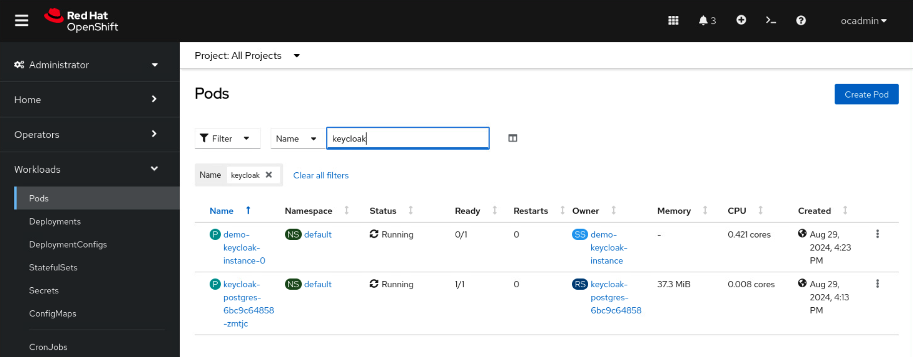

Applying the YAML files will also create Keycloak secrets, which contain usernames and passwords. View them in the `Developer` view under `Secrets`:

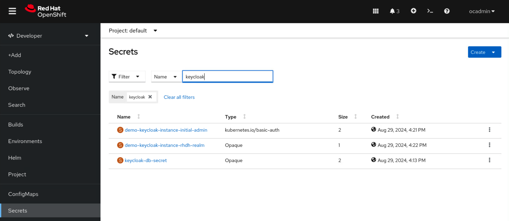

## 5. Create Service Account

To perform this step, you will need to be in the Administrative view.

Navigate to `User Management`, then click on `ServiceAccounts`.

From the Service Account panel, click on `Create ServiceAccount`.

In the YAML editor, change the `name` value to `rhdh-sa`.

Click `Create` to save the Service Account.

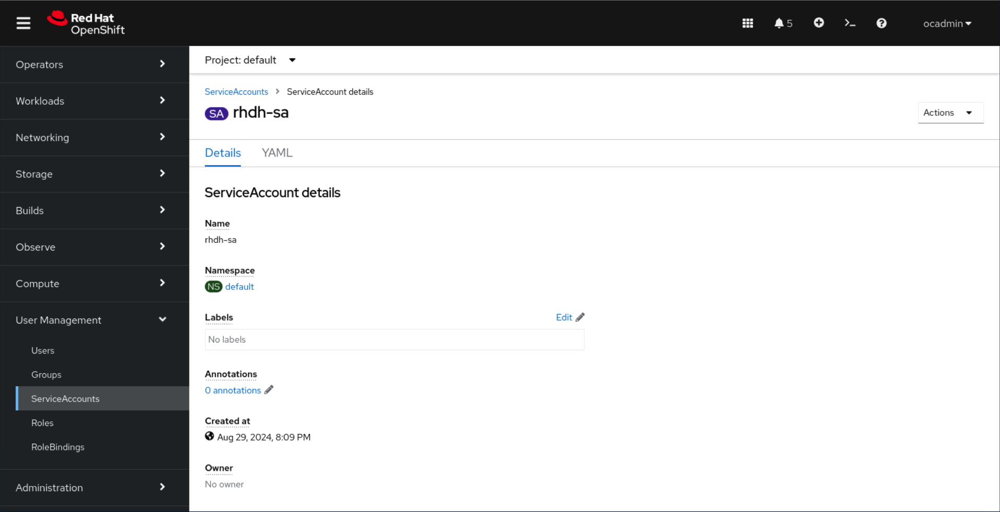

>**NOTE**: The creation of the Service Account will automatically generate an associated secret, which will be needed in a later step.

### Assign Role Binding to our Service Account

To perform this step, you will need to be in the Administrative view.

Navigate to `User Management`, then click on `RoleBindings`.

From the Role Bindings panel, click on `Create binding`.

In the `Create RoleBinding` form, set the following values:
- `Binding type` to `Cluster-wide role binding`
- `RoleBinding` name to `rhdh-sa-rb`
- `Role name` select `cluster-admin` (see note)
- `Subject` select `ServiceAccount`
- `Subject namespace` select `default`
- `Subject name` to `rhdh-sa`

>**NOTE:** Setting `Role name` to `cluster-admin` is not a best practice from a developers perspective. This would typically be set appropriately by an actual cluster administrator.

Click `Create` to save the Role Binding.

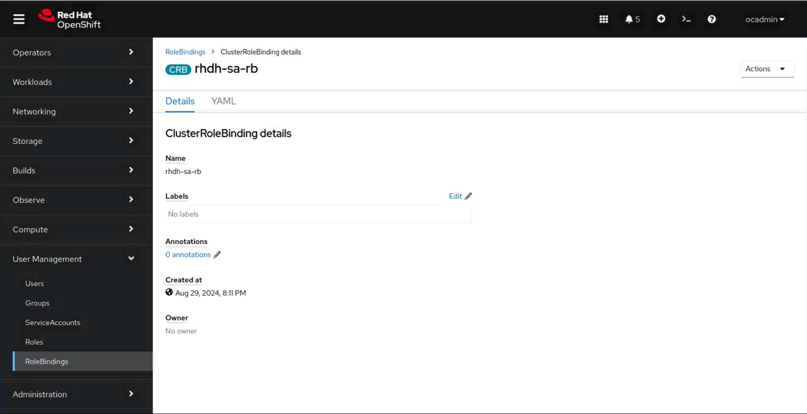

### Update Secrets with Service Account token

When you created your Service Account, an associated secret should have been auto-generated. To find the secret:

- From the Admistrator view, click on `Workloads` and then `Secrets`
- Identify the secret with the same prefix name as your Service Account, and is of the type `service-account-token`

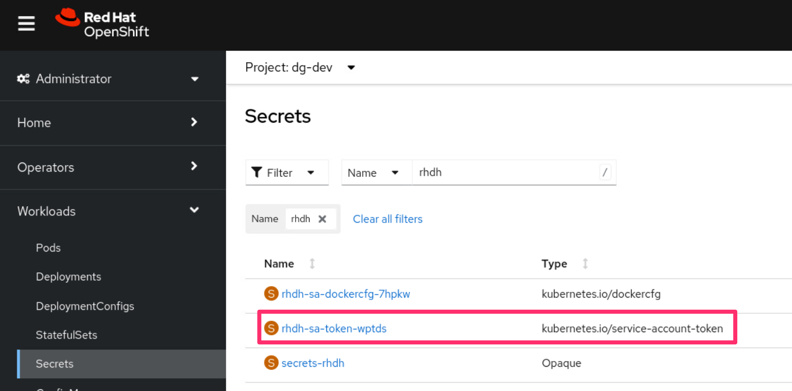

Click on the secret to show details.

From the details panel, click on `Reveal values` to view the token.

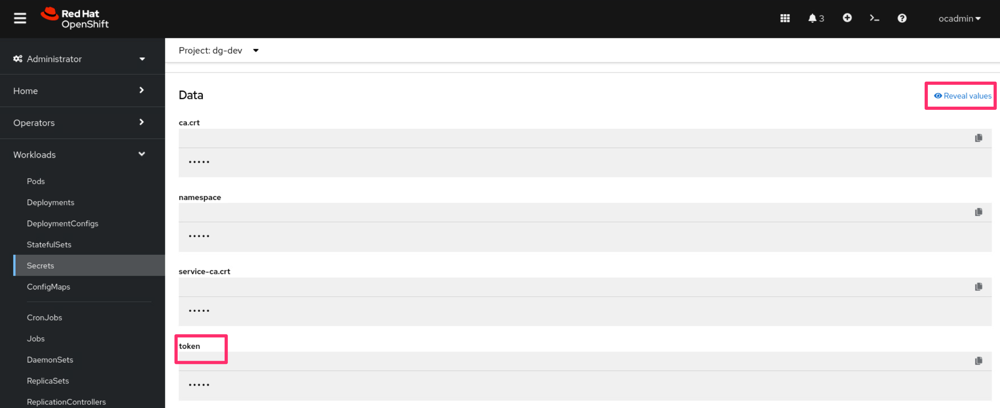

Copy the token so that we can add it to an existing Secret.

Return to the list of Secrets and edit the secret `secrets-rhdh`.

Under the `Actions` drop-down menu, click `Edit Secret`.

Add a new `key/value` pair to the secret, and set:
- key = `SA_TOKEN`
- value = token

`SA_TOKEN` is referenced in our `app-config` map.

## 6. Create ArgoCD instance

From the Admistrator view, click on `Installed Operators` and then click on the `Red Hat Openshift GitOps` operator.

Click on the `ArgoCD` tab, then click the `Create ArgoCD` button.

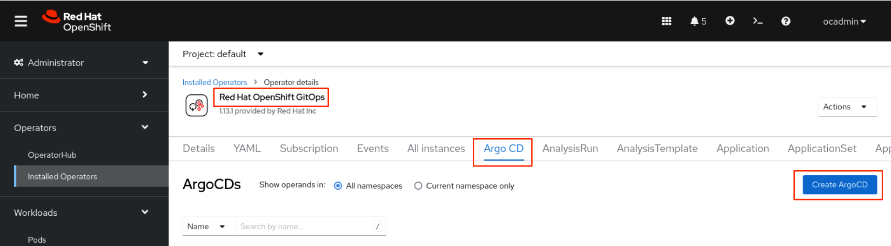

Accept all the default values and click `Create` to save. This will create an ArgoCD instance with the name `argocd`.

As a result, multiple ArgoCD pods will be deployed in your project (may take a few minutes).

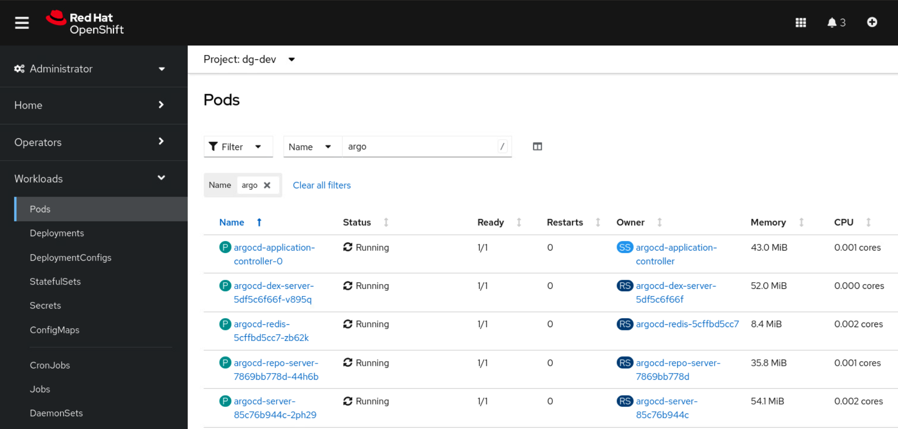

To determine the ArgoCD route, navigate to `Networking` and click on `Routes`.

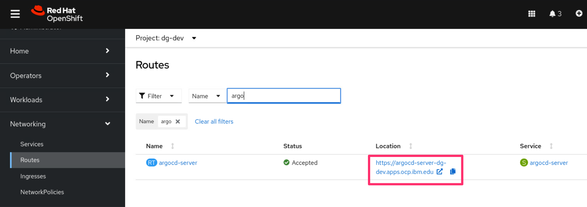

Click on the route to open up the ArgoCD UI.

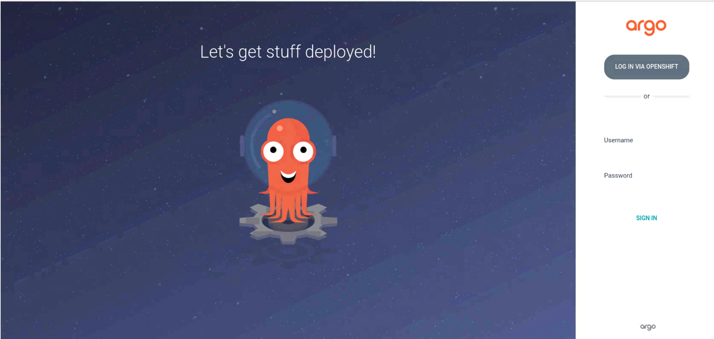

To get the `admin` password to log into the ArgoCD UI, navigate to the Developer view, then click on `Secrets`. Locate the secret named `argocd-cluster`.

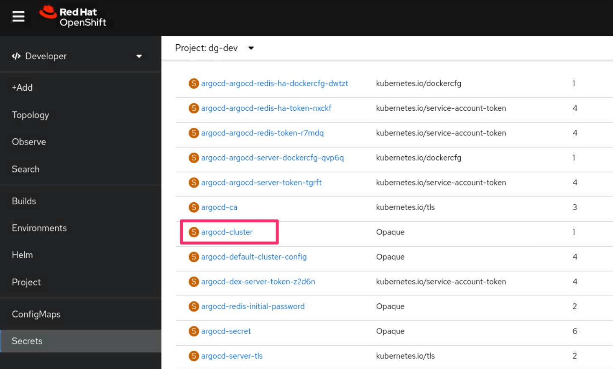

Click on it to show details. The admin password is located at the bottom of the panel

Set `Username` to `admin`, and enter the password to login to Argo.

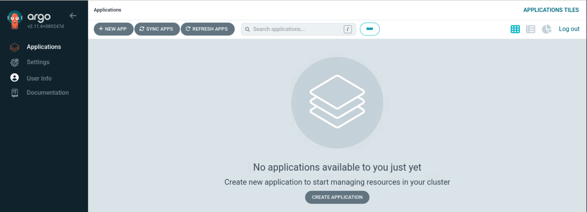

Remember the ArgoCD route and admin password, as they will be needed in the next step.

### Update config map with ArgoCD values

Edit the `app-config-rhdh` config map, and navigate down to the `argocd` section.

Update the `url` and `password` values, using the route URL and admin password obtained in the last step. Remember to save your changes.

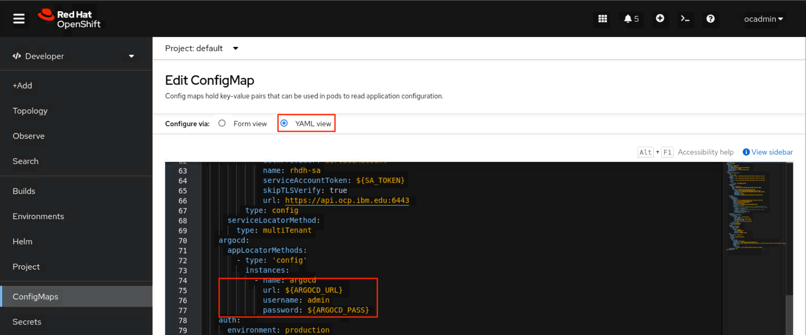

>**NOTE**: Do not include a trailing `/` at the end of the `url`.

## 7. Create a dynamic plug-in config map

Click the `Import YAML` button located at the top of the console.


Copy and paste the contents of the file [dynamic-plugins-rhdh.yaml](https://github.com/rhagarty/techxchange-rhdh/blob/main/dynamic-plugins-rhdh.yaml) into the YAML editor.

This will create a `Config Map` named `dynamic-plugins-rhdh`.

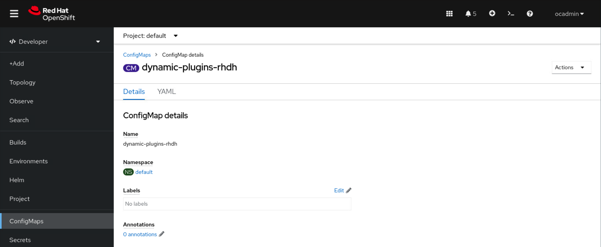

This enables all of the Backstage plug-ins.

## 8. Reconfigure the Red Hat Developer Hub Operator

From the Administrator view, go to the `Installed Operators` list and click on `Red Hat Developer Hub Operator`.

From the operator panel, click on the `Red Hat Developer Hub` tab.

Click `Edit backstage` using the drop-down menu for the `developer-hub` instance. 

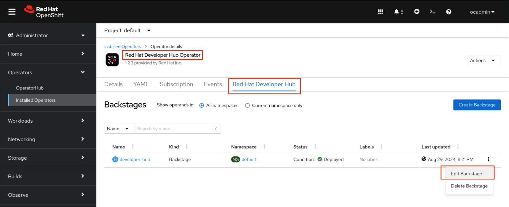

Replace the `spec` section with the contents of the [developer-hub.yaml](https://github.com/rhagarty/techxchange-rhdh/blob/main/developer-hub.yaml) file.

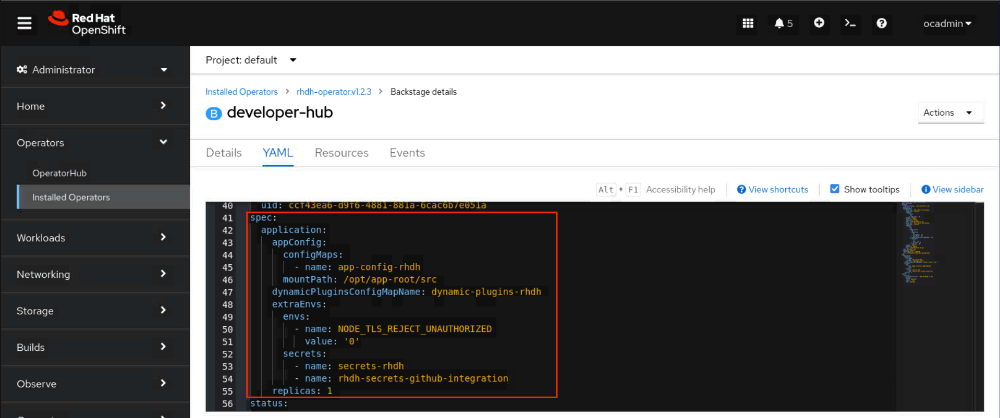

Save your changes.

This change will result in the restarting of the `backstage-developer-hub` pod (shown as in the `Init` stage).

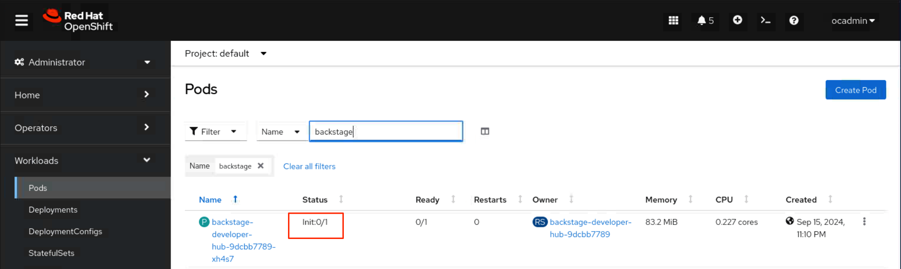

This restart process may take 5-10 minutes. You can click on the pod and then click the `Logs` tab to see the progress.

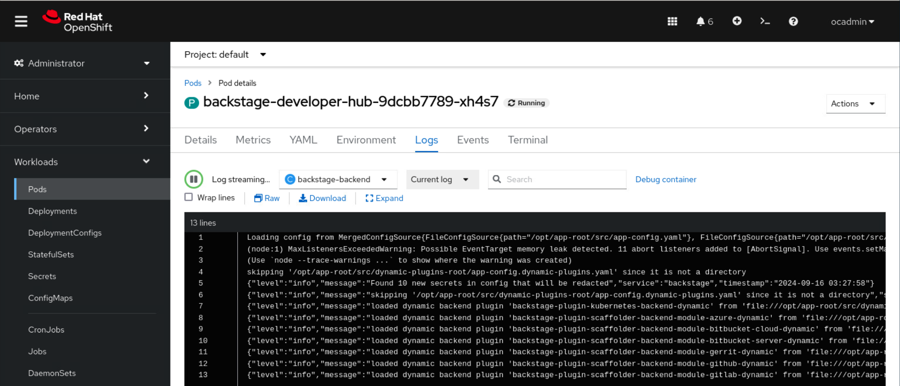

When complete, the status will be set to `Running`.

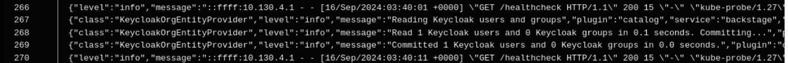

## 9. Open Backstage Developer Hub

From the Administrator view, click on `Networking`, and then `Routes`.

Click on the `backstage-developer-hub` route URL.

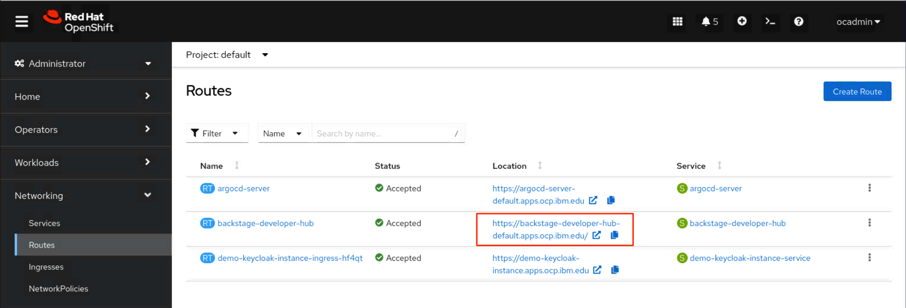

Sign into `Red Hat Developer Hub` backstage OIDC page by clicking `Sign In`. 

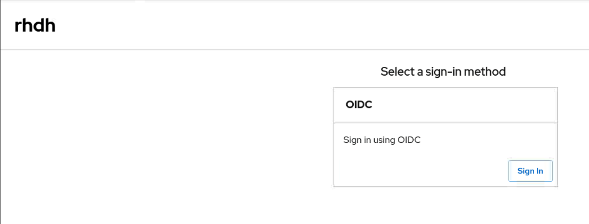

The username and password have already been set when we configured KeyCloak.

- Username: user1
- Password: rhdh

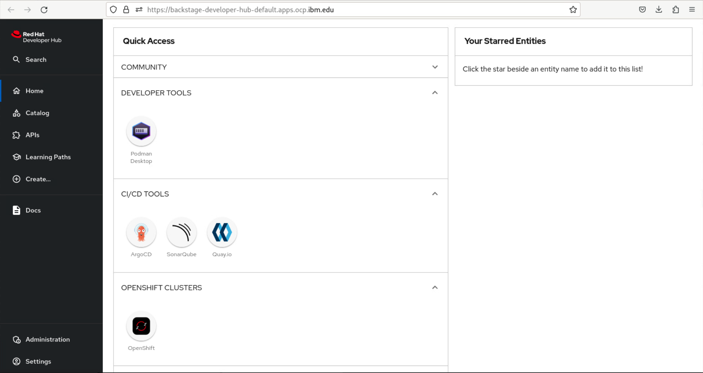

### Create Liberty App

From the main menu, click on `Create...`.

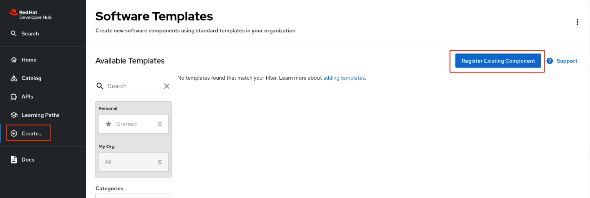

Click `Register Existing Component` to add our Open liberty template.

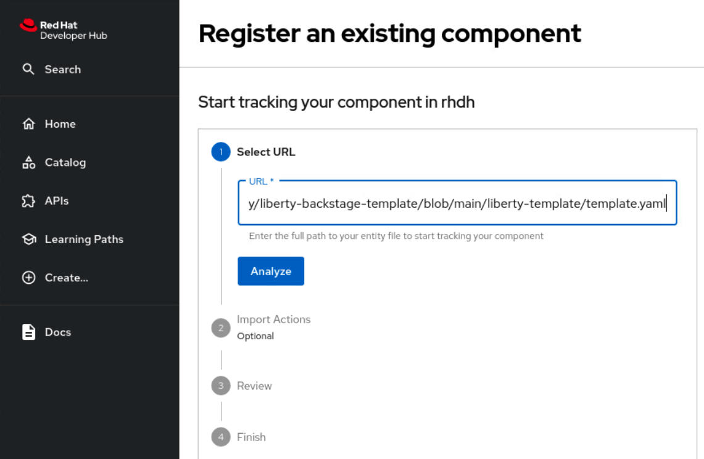

For `Select URL`, enter the Open Liberty "getting started" app template URL:
https://github.com/OpenLiberty/liberty-backstage-demo/blob/main/liberty-template/template.yaml

Click `Analyze`.

Once complete, click `Import` to add the components to the Backstage catalog.

Click `Create...` again to see the newly added template.

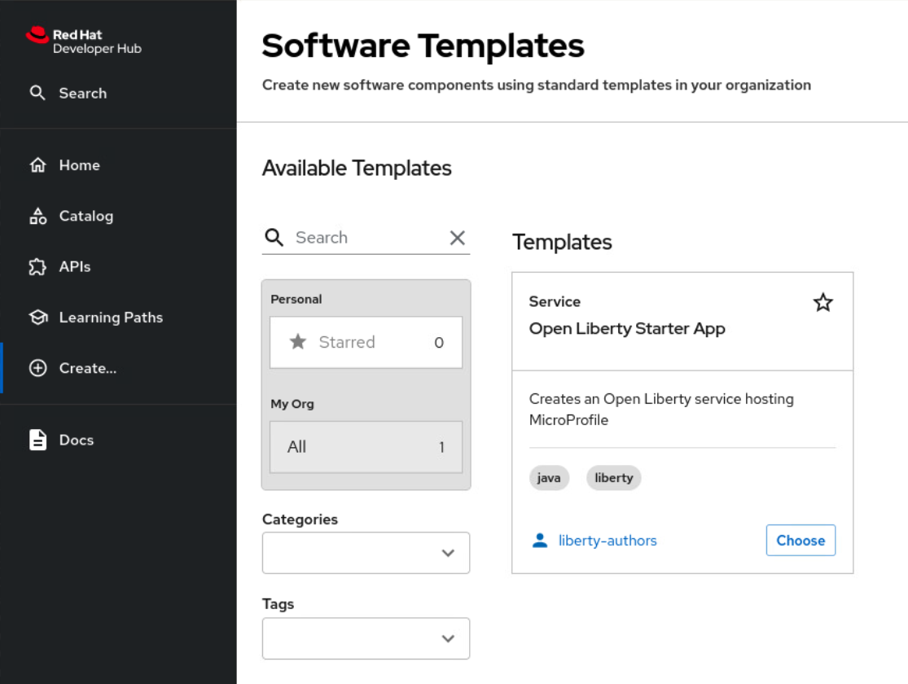

From the `Open Liberty Starter App` panel, click the `Choose` button.

Enter any blank required fields and press `Next` to continue through to fields.
- Repo Owner: Your GitHub account username
- Namespace: default
- Application Id: liberty-app-1 (or something unique)
- Select a CI method: GitHub Actions

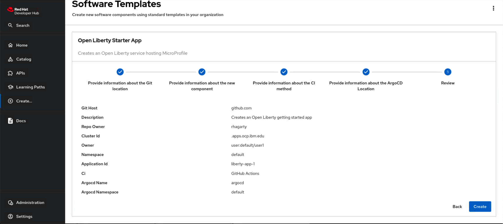

From the `Review` page, click `Create`.

Verify that it passes all of the steps in the pipeline. Note that if you `Start Over`, you will need to provide a unique `Application Id` value.

Click `Catalog` to see it was added.

Click on it to see deployment info (hopefully will include Liberty tab)
